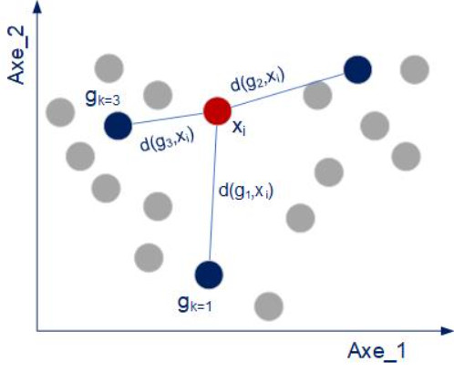

<style type="text/css">
body, td {font-size: 15px;}
code.r{font-size: 5px;}
pre { font-size: 12px;}
</style>


```{r setup, include=FALSE}
knitr::opts_chunk$set(echo = TRUE)
```

<FONT color='#0066CC'><FONT size = 4 >

::: {align="center"}
Fouille de données avec R pour la data science et l'intelligence artificielle\

TD 4 : Partie II - ANALYSE FACTORIELLE DISCRIMINANTE   

--Classification supervisée--
:::

</FONT></FONT>

<FONT color='#0066CC'><FONT size = 4 >

::: {align="center"}
Badr TAJINI -- ESIEE Paris\
Source : Bertrand Roudier -- ESIEE Paris
:::

</FONT></FONT>


<hr style="border: 1px  solid gray">

</hr>

<DIV align = justify>

<!--- /////////////////////////////////////////////////////////////////////--->
### <FONT color='#0066CC'><FONT size = 4> 1. Introduction </FONT></FONT>

Ce TD a pour objectif de réaliser la classification supervisée à l'aide de l'analyse factorielle discriminante.

Dans le précédent TD, nous avons réalisé: 

* Une diminution de dimension en calculant des axes de projections qui maximisent la dispersion inter groupe. Les vecteurs directeurs de ces axes factoriels correspondent aux vecteurs propres normalisés de la matrice : $\frac{B}{W}$ (méthode Anglo-saxone)   

* Les statistiques inférentielles relatives à la discrimination des groupes selon les axes (tests de Wilks)

* Le calcul des Scores. Ces derniers correspondent à la représentation des individus dans le plan formé par les (deux) premiers axes factoriels

Dans ce TD final, nous allons réaliser une classification de chaque individu dans le plan factoriel. Pour y parvenir: 

* Nous calculons le centre de gravité de chaque groupe dans le plan factoriel.
* Pour chaque individu, nous calculons les distances le séparant des centres de chaque groupe.  
* Nous affectons l'individu à la classe dont le centre de gravité est le plus proche.  

Pour évaluer la  qualité de la méthode de classification, nous réalisons une matrice de confusion. 

<U> **Rmq** </U>:  *Ce type de classification est possible que si la statistique montre préalablement l'existence significative d'une discrimination des groupes selon les axes factoriels*


<!--- /////////////////////////////////////////////////////////////////////--->

</FONT></FONT>

<hr style="border: 1px  solid gray">

</hr>

### <FONT color='#0066CC'><FONT size = 4> 2. Prérequis </FONT></FONT>


Nous effectuons la classification en reprenant dans un premier temps les données <VIN_QUALITES.txt>. Vous utiliserez les fonctions que vous avez développées dans le TD précédent (*MANOVA* et *AFD*)   
Pour rappel, la fonction (*AFD* ) retourne une liste avec les Scores (coordonnées des individus sur les axes factoriels).


```{r, echo = T, warning=F, message=F}
# à compléter
```

* La fonction permettant de réaliser le graphique est la suivante


```{r, echo = T}
# à compléter
```


```{r}
# à compléter
```


```{r}
# à compléter

```


```{r, echo = F}
# à compléter
```


Les Scores sont les suivants: 


```{r}
# à compléter
```

<!--- /////////////////////////////////////////////////////////////////////--->

</FONT></FONT>

<hr style="border: 1px  solid gray">

</hr>
<!--------------------------------------------------------------------->
### <FONT color='#0066CC'><FONT size = 4> 3. Classification </FONT></FONT>

<br>

#### <FONT color='#0066CC'><FONT size = 4> 3.1 Centres de gravité </FONT></FONT>

* Nous calculons les centres de gravité de chaque groupe dans le plan factoriel. Nous pouvons, par exemple utiliser la fonction *aggregate*.  

```{r}
# à compléter
```

<br>

* La représentation des centres de gravité et des individus

```{r}
# à compléter
```


#### <FONT color='#0066CC'><FONT size = 4> 3.2 Distances </FONT></FONT>


* Nous calculons les distances euclidiennes de chaque individu aux différents centre de gravité de chaque groupe.

```{r}
# à compléter
```

<br>


* Comme le montre la figure, L'affectation d'un individu correspond à la distance minimale entre cet individu et le centre de gravité d'un groupe (figure = groupe 3)


<br>


```{r, echo=FALSE, fig.width = 5, fig.height = 5, fig.align = 'center'}

```


<!------------------------------------------------------------------------->
#### <FONT color='#0066CC'><FONT size = 4> 3.3 Classification </FONT></FONT>

Le dataframe suivant compare la classification obtenue par l'AFD et les observations (Gold Standard)


```{r}
# à compléter
```

#### <FONT color='#0066CC'><FONT size = 4> 3.4 Qualité </FONT></FONT>

* Nous pouvons maintenant réaliser la matrice des confusions en utilisant la fonction *confusionMatrix* du package *caret*

```{r, message =FALSE}
# à compléter
```

<!------------------------------------------------------------------------->
#### <FONT color='#0066CC'><FONT size = 4> 3.5 Encapsulation </FONT></FONT>

* On construit une fonction ( que nous appelerons *AFD_Classif*) et qui "encapsule" le code 

La fonction doit retourner :

* les centre de gravités
* les distances de chaque individus aux centre des classes (groupes)
* la comparaison entre la classification réalisée par l'AFD et le gold standard
* la matrice de confusion (obtenue à l'aide de la fonction caret)

```{r}
# à compléter

```

<!--------------------------------------------------------------------->
### <FONT color='#0066CC'><FONT size = 4> 4. Déploiement </FONT></FONT>

* Pour déployer le code, on utilisera le fichier *iris* fournit par défaut  dans R

```{r, echo = T}
# à compléter

```
Les résultats sur le fichier *iris* sont les suivants

* Centres de gravité

```{r}
# à compléter
```

<br> 

* Distances 


```{r}
# à compléter
```

<br> 

* Classification 


```{r}
# à compléter
```

* Confusion

```{r}
# à compléter
```


