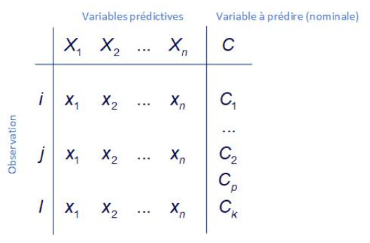
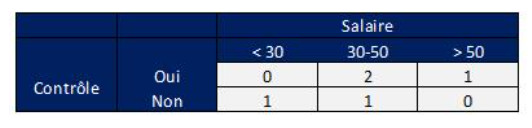
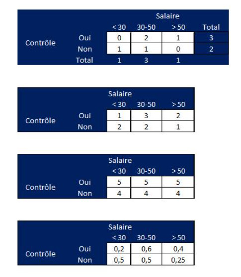

---
title: "<FONT color='#0066CC'><FONT size = 4 ><DIV align= center> AP-4209 ESIEE-Paris: 2023 -2024 </DIV></FONT></FONT>"
output:
  html_document:
    highlight: textmate
    theme: readable
    toc: yes
    toc_depth: 6
    toc_float: yes
---


```{=html}
<style type="text/css">
body, td {font-size: 17px;}
code.r{font-size: 5px;}

pre { font-size: 15px;}
</style>
```


```{r setup, include=FALSE}
knitr::opts_chunk$set(echo = TRUE)
```

<FONT color='#0066CC'><FONT size = 4 >

::: {align="center"}
Fouille de données avec R pour la data science et l'intelligence artificielle\

TD 2 : II. CONSTRUCTION D'UN CLASSIFIEUR BAYESIEN NAIF EN R
:::


</FONT></FONT>

<FONT color='#0066CC'><FONT size = 4 >

::: {align="center"}
Badr TAJINI -- ESIEE Paris\
Source : Bertrand Roudier -- ESIEE Paris
:::

</FONT></FONT>

<hr style="border: 1px  solid gray">

</hr>
Il s'agit de développer un script complet en R  permettant de réaliser une classification bayésienne analogue à celles fournies par différents paquets R  
Pour y parvenir, il est nécessaire de bien comprendre le "fonctionnement" d'une classification Bayésienne (développé dans le cours) en décomposant les différents calculs par étape:  
  
  * Calcul des probabilités conditionnelles (Vraisemblance)  
  * Calcul des probabilités a postériori en fonction du niveau de la variable à prédire
  * Maximisation de la fonction *ln(h<SUB>map </SUB>)*

<br>
Dans un premier temps, nous développerons l'algorithme à l'aide d'un jeu de données très simple: celui fourni en cours. Les résultats de toutes les étapes seront fournies, à vous de développer les scripts pour y parvenir.
Une fois le programme mis au point (que nous considérerons comme la phase de développement), Vous testerez votre programme sur un jeu de données plus conséquent. Les résultats que vous obtiendrez seront comparés à des fonction R déjà implémenté. Nous évaluerons ensuite, à l'aide de matrices de confusion les résultats obtenus.

<hr style="border: 1px  solid gray">

### <FONT color='#000033'><FONT size = 3> 1. RAPPELS  </FONT></FONT> 


-   Le classifieur bayesien naïf est une méthode d'apprentissage supervisé fondée sur le théorème de Bayes. Elle repose sur une hypothèse forte : les descripteurs (Xj) sont deux à deux indépendants conditionnellement aux valeurs de la variable à prédire (Y).

-   Cette méthode simple à implémenter, se révèle cependant très robuste par rapport à un écart d'indépendance et ses performances sont comparables aux autres techniques d'apprentissage souvent bien plus complexes pour des grands volumes de données.

remarque importante. Cette présentation est inspiré des remarquables cours de Ricco RAKOTOMALA disponible sur le blog TANAGRA : http://tutoriels-data-mining.blogspot.com


##### <FONT color='#000033'> <FONT size = 3> 1.1 Définition </FONT> </FONT>

-  Deux évènements A et B sont indépendants si la connaissance de l'un ne modifie pas la connaissance de l'autre. Dans ces conditions (indépendance) :

$$\left. \begin{array}{l}
P(A/B) = P(A)\\
P(B/A) = P(B)\\
P(A \cap B) = P(A)P(B)
\end{array} \right\}P(A/B) = \frac{{P(B/A)P(A)}}{{P(B)}}$$

##### <FONT color='#000033'><FONT size = 3> 1.2 Classifieur et règle bayésienne </FONT> </FONT>

-   Soit un jeux de données (matrice prédictive) composée de n prédicteurs X (n variables). La variable à prédire Y est composée de k classes C.

<br>
<center> 
     {#id .class width="50%" height="50%"} 
</center>

<br>

**remarque importante**. Nous considérons dans cette exemple que les variables explicatives sont catégorielles. Chacunes d'elles possédent l modalités (l étant différent d'une variable à l'autre)

* La probabilité d'appartenance d'un individu à une classe connaissant à priori ses valeurs x (les observations pour cet individu) est donnée par la régle bayésienne :

 \[P({C_k}/{X_n}) = \frac{{P({X_n}/{C_k})P({C_k})}}{{P({X_n})}}\]


**1.2.1.** La probabilité d'observer une réalisation (un individu i - une ligne) connaissant sa classe d'appartenance k est la suivante :
<center>
\[P({X_1} = {x_1},{X_2} = {x_2},...,{X_n} = {x_n}/{C_k})\]
</center>

* Cette probabilité est appelée la vraisemblance. Sous hypothèse d'indépendance (condition nécessaire au développement suivant), nous avons le développement suivant:

<center>
\[P({X_1} = {x_1},{X_2} = {x_2},...,{X_n} = {x_n}/{C_k}) = P({X_1} = {x_1}/{C_k})P({X_2} = {x_2}/{C_k})...P({X_n} = {x_n}/{C_k}) = \prod\limits_{p = 1}^n {P({X_p}/{C_k})} \]
</center>

**1.2.2.**   La probabilité d'observer une réalisation (un individu i - une ligne) quelque-soit sa classe d'appartenance est : 
<center>
\[P({X_1} = {x_1},{X_2} = {x_2},...,{X_n} = {x_n}) = P({X_1} = {x_1})P({X_2} = {x_2})...P({X_n} = {x_n}) = \prod\limits_{p = 1}^n {P({X_p})} \]
</center>

**1.2.3.** La probabilité qu'un individus appartienne à la classe k est : $P({C_k})$

La probabilité d'appartenance est la suivante :

\[P({C_k}/{X_n}) = \frac{{P({C_k})\prod\limits_{p = 1}^n {P({X_p}/{C_k})} }}{{\prod\limits_{p = 1}^n {P({X_p})} }}\]

* rmq: Un exemple pratique de calcul des probabilités est fourni dans le cours **classification bayésienne** *

<hr>
<br>

##### <FONT color='#000033'><FONT size = 3> 1.3 Régles d'affectations </FONT></FONT>

* Pour chaque individus de la base, on calcule la probabilité d'appartenance $P({C_k}/{X_n})$ à TOUS les groupe k. l'affectation à un groupe sera :
<center>
 \[{h_{map}} = \arg {\max _k}\left( {\frac{{P({C_k})\prod\limits_{p = 1}^n {P({X_p}/{C_k})} }}{{\prod\limits_{p = 1}^n {P({X_p})} }}} \right)\]
</center>


* *rmq:*  hmap est aussi appelé maximum de vraisemblance à posteriori

* Sachant que $P({X_1} = {x_1},{X_2} = {x_2},...,{X_n} = {x_n}) = \prod\limits_{p = 1}^n {P({X_p})}$ est, pour un individu, **une constante**, elle n'intervient pas dans le calcul du maximum de
vraisemblance à postériori. La fonction précédente peut donc être simplifiée :

<center>
 \[{h_{map}} = \arg {\max _k}\left( {P({C_k})\prod\limits_{p = 1}^n {P({X_p}/{C_k})} } \right)\]
</center>


##### <FONT color='#000033'><FONT size = 3> 1.4 Corrections </FONT></FONT>


* Pour éviter d'obtenir des probabilités conditionnelles nulles ${P({X_p}/{C_k})}$ (Vraisemblance), on utilise aussi un facteur correctif.
Soit ${n_x}$ le nombre d'observations $X = {x_i}$ d'une variable X (nombre de modalités = ${x_i}$ pour une variable), ${n_{ki}}$ le nombre d'observations appartenant à *k* pour la modalité ${x_i}$ de X, le facteur correctif est le suivant:

<center>
\[P({X_p}/{C_k}) = \frac{{{n_{ki}} + m}}{{{n_k} + mk}}\]
</center>

Pour rappel ;

* *k* est le nombre de facteur de la variable à prédire 
* *m* est la facteur correctif de Laplace

##### <FONT color='#000033'><FONT size = 3> 1.5 Tranformation logarithmique  </FONT></FONT>

* La fonction hmap est passée en logarithme tel que :

\[{h_{map}} = \arg {\max _k}\left( {\ln \left( {P({C_k})} \right) + \sum\limits_{p = 1}^n {\ln \left( {P({X_p}/{C_k})} \right)} } \right)\]


D'un point de vue calculatoire, le produit de nombreuses probabilités (toutes bien évidemment inférieures à 1 !)  peut rapidement provoquer des débordements de mémoire. le passage en log permet d'éviter ce problème

<br>
<hr style="border: 1px  solid gray">

### <FONT color='#000033'><FONT size = 3> 2. PROGRAMMATION </FONT> 


Nous allons procéder en deux étapes    
  
  - Calcul des tableaux des probabilités conditionnelles puis stockage de ces derniers dans des listes. 
  - Calcul des probabilités *a posteriori* et affectation par argmax sur un jeu de données test
  
  
Au préalable, nous créons le dataframe contenant le jeu de données (simplissime !) fourni en cours.  

Nous utilisons :   

  * le package [kableExtra](https://cran.r-project.org/web/packages/kableExtra/vignettes/awesome_table_in_html.html) qui permet de réaliser des "beaux" tableaux au format html ou pdf.   
  * le package *caret* pour les matrices de confusion    
  * le paquest *e1071* qui réalise la classification Bayésienne. Les résultats développés dans vos scripts seront comparés à ceux fournis par cette librairie     
  
*rmq*: Ne jamais oublier d'effacer  toutes les variables en mémoire au début de votre script (réinitialiser l'environnement)

```{r}
# On supprime les valeurs en mémoire
rm(list=ls())

# Chargement des packages
library(kableExtra)
library(caret)
library(e1071)
```


```{r, echo = T}
df = data.frame('Salaire' = c('< 30', '30 - 50', '30 - 50', '30 - 50', '> 50'),

                'Impots' = c('< 20','< 20','< 20','> 20','> 20'),

                'Etudiant' = c('Oui','Non','Oui','Non','Non'),

                'Controle' = c('Non','Oui','Oui','Non','Oui'))
```

Affichage du tableau avec *kableExtra*

```{r}
df %>% kbl(digits=3) %>%    
       kable_styling(bootstrap_options = "striped", full_width = F, position = "center", latex_options = 'stripped') %>% 
       scroll_box( height = "250px")
```
### Explication
Ce bloc de code effectue plusieurs opérations initiales :
1. `rm(list = ls())` : Supprime tous les objets présents dans l'environnement de travail R 
  pour repartir sur une base propre.
2. `library(kableExtra)` : Charge le package `kableExtra`, utilisé pour créer des tables 
  formatées et améliorées dans R Markdown.
3. `library('e1071')` et `library('caret')` : Charge les packages `e1071` et `caret`. `e1071` 
  est souvent utilisé pour des méthodes statistiques, et `caret` pour le machine learning.


On scinde le dataFrame et l'on crée un dataFrame X (prédicteur) et un vecteur des catégories à prédire (Y)

```{r, echo = T}
Y <- df$Controle
```
##### Explication 
On extrait la colonne Controle de notre dataframe 
qui est la variable à prédire


```{r, echo = F}
X <- subset(df, select = -c(Controle))
```
##### Explication
On extrait toutes nos colonnes sauf Controle

```{r}
X %>% kbl(digits=3) %>%    
       kable_styling(bootstrap_options = "striped", full_width = F, position = "center", latex_options = 'stripped') %>% 
       scroll_box( height = "250px")
```
<hr>

##### <FONT color='#000033'><FONT size = 3> 2.1 Probabilité conditionnelle </FONT></FONT>

###### <FONT color='#000033'><FONT size =3> 2.1.1 Tableau de contingence </FONT> </FONT> 

Dans un premier temp Nous cherchons ici à créer les tableaux de contingence entre les différentes variables du prédicteur et la variable à prédire. 
Nous créons ainsi 3 tableaux. A titre d'exemple, le tableau de contingence *contrôle* x *salaire* est le suivant: 


<center> 
     {#id .class width="50%" height="50%"} 
</center>

<br>
     
     
les trois tableaux sont stockés dans une liste. Pour y parvenir, on utilise La fonction  *table* de R qui réalise les tableaux. Le calcul de chaque tableau ainsi que le stockage sont réalisés par une fonction *lapply*. 
Si vous éprouver des difficultés, il est possible d’utiliser dans un premier temps une boucle pour la mise au point, puis transformer la boucle et un *lapply*

* Chaque nom des objets de la liste (eq clés dictionnaires python) doit correspondre au nom de la variable ( ce qui est, en principe, automatiquement réalisée
* La structure des tables doit être la même:  la variable à expliquer en colonne et la variable explicative en ligne (cf. tableaux précédents)
* on nommera cette liste : "contingence"

les résultas R sont les suivants;

```{r, echo = T}
contingence<- lapply(X, function(x){  
  temp_1   <- table(Y,x)         # tableau initiale 
}) 
contingence
```
##### Explication
Ce code crée une liste nommée `contingence`. La fonction `lapply` est utilisée pour appliquer une fonction anonyme à chaque colonne de `X`. Cette fonction crée un tableau de contingence (`table`) entre la variable `Y` et chaque colonne de `X`. Le résultat est une liste de tableaux de contingence pour chaque variable explicative dans `X`.

###### <FONT color='#000033'><FONT size =3> 2.1.2 Probabilités conditionnelles corrigées </FONT> </FONT> 

- Pour palier au problème conditionnelle nulle, on corrige le tableau de contingence en ajoutant à toutes les valeurs la quantité m (par défaut = 1) 

- Pour calculer les probabilités conditionnelles corrigées, il suffit de diviser élément par élément les deux tableaux précédents : $P({a_i}/{c_k}) = \frac{{{n_{kl}} + m}}{{{n_k} + mk}}$ 

- Les différentes étapes de correction sont résumés, pour la variable salaire comme suit: 
  * Création du tableau de contingence 
  * Correction du tableau
  * Calcul de la somme nk + m*k
  * Calcul des probabilités conditionnelles corrigées 

<br>

<center> 
     {#id .class width="50%" height="50%"} 
</center>


<br>     
 
L'ensemble des calculs est réalisé en modifiant les tableaux de contingence de la liste.

A partir des tableaux de contingence stockés dans la liste, nous obtenons la liste des probabilités conditionnelles:
Nous appelons cette nouvelle liste  *prop_cond*

```{r, echo = T}
k <- length(unique(Y))
m <- 1

prob_cond <- lapply(X, function(x){  
                temp_1 <- table(Y,x)         # tableau initiale 
                s      <- apply(temp_1,1, sum) +  m * k  # calcul des sommes + pondération
                mat    <- matrix(s, ncol = ncol(temp_1), nrow = nrow(temp_1))  # matrice des sommes
                out <- (temp_1 + m)/mat  # calcul des nk = pondération de Laplace
                }) # somme des controles

prob_cond 
```
##### Explication
Ce script calcule les probabilités conditionnelles :
1. `k` est le nombre de valeurs uniques dans `Y`.
2. `m` est une constante (ici, 1) utilisée pour la pondération.
3. La fonction `lapply` applique une fonction à chaque colonne de `X` qui :
   - Crée un tableau de contingence entre `Y` et la colonne courante de `X`.
   - Calcule des sommes pondérées pour chaque ligne.
   - Crée une matrice de ces sommes.
   - Calcule les probabilités conditionnelles avec une correction de Laplace (pondération `m`).


##### <FONT color='#000033'> <FONT size = 3> 2.2 Prédiction et Vraisemblance </FONT></FONT>
- Une fois les probabilités conditionnelles calculées, nous pouvons réaliser une prédiction sur un jeux de données test. 
Pour y parvenir :
- Nous cherchons à déterminer, pour chaque individus test, quelles sont les probabilités d'appartenances aux groupes (contrôle = Oui - contrôle = Non) connaissant les valeurs des variables prédictives.
- L'affectation à un groupe (contrôle = Oui - contrôle = Non) s'effectue en sélectionnant la probabilité max.

Nous devons calculer, pour chaque individus test, la probabilités à postériori (eq. max de vraisemblance a posteriori) :
<center>
\[\begin{gathered}
  P({C_{k = Oui}}/{X_p}) = P({C_k})\prod\limits_{p = 1}^n {P({X_p}/{C_{k = Oui}})}  \hfill \\
  P({C_{k = Non}}/{X_p}) = P({C_k})\prod\limits_{p = 1}^n {P({X_p}/{C_{k = Non}})}  \hfill \\ 
\end{gathered} \]
</center>

Pour éviter les problèmes de débordement de capacité mémoire nous calculerons  directement les log de la vraisemblance à postériori
<center>
\[\begin{gathered}
  \ln \left( {({C_{k = Oui}}/{X_p})} \right) = \ln \left( {P({C_k})} \right) + \sum\limits_{p = 1}^n {\ln \left( {P({X_p}/{C_{k = Oui}})} \right)}  \hfill \\
  \ln \left( {({C_{k = Non}}/{X_p})} \right) = \ln \left( {P({C_k})} \right) + \sum\limits_{p = 1}^n {\ln \left( {P({X_p}/{C_{k = Non}})} \right)}  \hfill \\ 
\end{gathered} \]
</center>

Le jeu des données test est le suivant (*data_test*) :

```{r, echo = T}
data_test <- data.frame( 'Salaire' = c('30 - 50', '> 50','< 30'),
                         'Impots'  = c('< 20', '< 20' ,'< 20')  ,
                         'Etudiant' = c('Oui','Non' ,'Oui')
                            )
```
##### Explication
Ce code crée un nouveau dataframe `data_test` contenant des données de test. Il comprend trois colonnes (`Salaire`, `Impots`, `Etudiant`) avec des valeurs spécifiques.
```{r, echo = T}
data_test %>% kbl(digits=3) %>%    
       kable_styling(bootstrap_options = "striped", full_width = F, position = "center", latex_options = 'stripped')
```
##### Explication
Ce code utilise le dataframe `data_test` et l'affiche sous forme de tableau formaté à l'aide de la suite de fonctions de `kableExtra`. Les options de style sont similaires à celles utilisées précédemment, y compris le formatage à trois chiffres après la virgule, l'ajout de rayures pour améliorer la lisibilité et le positionnement central du tableau.


###### <FONT color='#000033'><FONT size = 3>  2.2.1 Appartenance *a priori* </FONT></FONT>

La probabilité d'appartenance à priori correspond à la probabilité qu'un individus ait un contrôle ou non. Elle est calculée à partir des données entraînement.  Les résultats sont stockés dans un vecteur *priori*. De plus, on stocke le "nom" des catégories dans un vecteur(ici il s'agit simplement de 'Oui' et 'Non')

```{r, echo = T}
priori <- prop.table(table(Y))
priori_labels  <- names(priori)
```
##### Explication
1. `priori <- prop.table(table(Y))` : Cette ligne crée une table de proportions (`prop.table`) à partir du tableau de fréquences de `Y`. Cela permet de calculer les probabilités a priori pour chaque catégorie unique dans `Y`.
2. `priori_labels <- names(priori)` : Enregistre les noms des catégories uniques de `Y` dans une variable `priori_labels`.


```{r}
priori
```
##### Explication
Ceci est un simple appel à la variable `priori` pour afficher ses valeurs. Rappelons que `priori` contient les probabilités a priori de chaque catégorie unique dans `Y`.
```{r}
priori_labels
```

##### Explication
Cette ligne affiche simplement le contenu de la variable `priori_labels`, qui contient les noms des catégories uniques de `Y` déterminées précédemment. C'est utile pour vérifier les différentes catégories utilisées dans les calculs de probabilités.


Les probabilités d'affectation pour chaque individus test sont stockées dans une matrice. Les résultats sont les suivants :

```{r, echo = T}

# à compléter
```

Pour réalisér les calculs, la méthode est la suivante :

Réaliser 3 boucles "for" imbriquées   

  * la première boucle pour sélectionner chaque individu dans le dataframe *data_test*
  * la seconde boucle pour extraire la probabilité à priori (variable *priori*)
  * la troisième boucle pour extraire les tableaux de probabilités conditionnelles stockés dans la liste *prob_cond*
      *  on extrait les probabilités (par les noms des lignes et des colonnes)
      *  on calcule la somme des log

Exemple  
  
  * Boucle 1 : sélection de l'individu : Salaire = 30-50 , impot < 20 , Etudiant = Oui   
  * Boucle 2 : extraire la probabilités a priori : Priori = Oui  (qui correspond à contrôle = Oui) P = 0.6  
  * Boucle 3 :  
      - extraire les probabilités conditionnelles des tableaux   
        -  Salaire = 30-50 et contrôle = Oui  (= 0.5)  
        -  Impot < 20 et contrôle = Oui        
        -  Etudiant = Oui et Controle = Oui   
      - faire la somme des log des probabilités = logS  
  * Dans la boucle 2 (après la boucle 3) , on calculera les probabilités à posteriori d'affectation  
      - log(0.6) +  logS  
    
L'ensemble des résultats sera stocké dans un tableau (data.frame) 


On choisira max(hmap) pour prédire la présence ou l'absence de contrôle. Les résultats seront résumés dans un data.frame


```{r}
Test    <- NULL
LnTest  <- NULL
for (i_test in 1:nrow(data_test))    # sélection des individus du jeux test
{ V    <- NULL
  lnV  <- NULL
  for(ic in 1:length(priori))        # sélection des Ck Oui
    {   somme <- 0 ; prod <- 1
        for(i in 1:ncol(X))          # sélection des tableau de proba conditionnelles
          {
           ar    <-  prob_cond[[i]]  # on extrait les tableau des probailiyés conditionnelles de la liste 
           somme <- somme + log( ar[priori_labels[ic],data_test[i_test,i]])
           prod  <- prod *   ar[priori_labels[ic],data_test[i_test,i]]
      
        }
     V     <- c(V, priori[ic] * prod )
    lnV   <- c(lnV, log(priori[ic]) + somme ) 
  }  
}
Test  <- rbind(Test, V)    
LnTest <- rbind(LnTest, lnV)    

```

##### Explication
Ce script complexe effectue les calculs suivants pour chaque ligne dans `data_test` :
1. Itère sur chaque catégorie dans `priori`.
2. Calcule la somme des logarithmes et le produit des probabilités conditionnelles pour chaque variable dans `X` par rapport à la catégorie actuelle.
3. Multiplie la probabilité a priori de la catégorie par le produit des probabilités conditionnelles.
4. Ajoute ces résultats dans les tableaux `V` et `lnV`.
5. Les résultats pour chaque ligne de `data_test` sont stockés dans `Test` et `LnTest`.

```{r}
data.frame(LnTest)%>% kbl(digits=4) %>%    
       kable_styling(bootstrap_options = "striped", full_width = F, position = "center", latex_options = 'stripped')
```

<br>
<hr style="border: 1px  solid gray">

### <FONT color='#000033'><FONT size = 3> 3. FONCTIONS </FONT> 
               
Une fois les scripts validés, Nous allons écrire deux fonctions génériques qui nous permettront de réutiliser le code indépendamment du nombre de variables et du nombre de catégories (labels).

#### <FONT color='#000033'><FONT size = 3> 3.1 Naive_Bayes </FONT> 

La première fonction que nous appelerons *Naive_Bayes* declarée comme suit :


calculera les probabilités conditionnelles corrigées par le facteur m et les probabilités d'appartenance *priori*:   

> <FONT size = 3>  *Naive_Bayes <- fonction( X,Y, m=1){....}* </FONT>

Cette fonction devra retourner la liste suivante:  

> <FONT size = 3>  *out <- list('prob_cond' = prob_cond, 'priori' = priori)* </FONT>

* prob_cond est la liste des tableaux des probabilités conditionnelles pour chaque variable
* priori étant le tableau des probabilités d'appartenance au groupes (contrôle = Oui, Contrôle = Non)

```{r}
resulTest <- data.frame(data_test, 'Pred' = colnames(LnTest)[apply(LnTest,1,which.max)] ) 

resulTest %>% kbl(digits=4) %>%    
       kable_styling(bootstrap_options = "striped", full_width = F, position = "center", latex_options = 'stripped')
```

##### Explication
Ce code combine les données de test (`data_test`) avec les prédictions effectuées (`Pred`), où `Pred` est calculé en prenant l'indice de la valeur maximale dans chaque ligne de `LnTest`. Les résultats sont ensuite formatés et affichés sous forme de tableau.

Les résultats sont les suivants:
```{r}
Naive_Bayes <- function(X, Y, m = 1)
{
  # ...
  return(out)
}
```

```{r}
model_1 <- Naive_Bayes(X, Y, m=1)
print(model_1)
```

### Explication
Ceci crée un modèle Naïve Bayes en utilisant les données `X` et `Y`, avec `m = 1` pour la correction de Laplace. Le modèle résultant (`model_1`) est ensuite affiché.


##### Explication
Cette fonction définit un classificateur Naïve Bayes personnalisé. Elle prend en entrée les variables explicatives `X`, la variable à prédire `Y` et un paramètre `m` pour la correction de Laplace. La fonction calcule les probabilités conditionnelles et les probabilités a priori, puis retourne ces valeurs.
<br>

#### <FONT color='#000033'><FONT size = 3> 3.2 Prédiction </FONT> 

Pour réaliser la prédiction, nous créons une fonction *Predict_Bay* qui retournera les prédictions (log_Vraiseemblance) et l'affectation sous forme de DataFrame. Cette fonction aura deux arguments: 

> <FONT size = 3>  *Predict_Bayes <- fonction(prob_cond, X_pred){....}* </FONT>

  * *prob_cond* qui correspond à la liste retournée par la fonction *naive_Bayes*
  * *X_pred* est le dataframe dont il faut prévoir les Y

les résultats sont les suivants
```{r}
Predict_Bayes <- function(model, X_pred)
{
  # ...
  return(out)
}
```

##### Explication
Cette fonction définit une méthode de prédiction pour le modèle Naïve Bayes. Elle prend un modèle Naïve Bayes préalablement ajusté et un ensemble de données de test (`X_pred`), puis calcule les prédictions en utilisant le modèle donné.

##### Note :
Oui, la fonction #19, qui définit `Predict_Bayes`, est effectivement similaire à une autre fonction dans mes réponses précédentes. Elle est semblable à la fonction #14, où un processus similaire de prédiction est appliqué. Dans les deux cas, les fonctions exécutent des étapes de prédiction basées sur le modèle Naïve Bayes :

1. **Itération sur les données de test** : Les deux fonctions itèrent sur chaque ligne de l'ensemble de données de test.
2. **Calcul des probabilités** : Elles calculent les probabilités en utilisant les probabilités conditionnelles et les probabilités a priori du modèle Naïve Bayes.
3. **Logarithme des probabilités** : Les probabilités sont traitées en utilisant le logarithme pour éviter des problèmes de sous-débordement numérique (lorsque les probabilités sont très petites).
4. **Combinaison des probabilités** : Les probabilités de chaque classe sont combinées (par exemple, en utilisant la somme des logarithmes) pour obtenir la probabilité finale.
5. **Détermination de la classe prédictive** : La classe avec la plus haute probabilité (ou son logarithme) est choisie comme la prédiction pour chaque observation.

La principale différence est que la fonction #19 est définie comme une fonction générique à part entière, prête à être utilisée sur différents ensembles de données ou modèles, tandis que la fonction #14 représente un script spécifique pour une tâche de prédiction donnée.


```{r}
result_pred <- Predict_Bayes(model_1, data_test)
```

#####    Explication
Ce code utilise la fonction `Predict_Bayes` pour faire des prédictions sur `data_test` en utilisant le modèle `model_1`.

```{r}
result_pred %>% kbl(digits=3) %>%    
       kable_styling(bootstrap_options = "striped", full_width = F, position = "center", latex_options = 'stripped') %>% 
       scroll_box( height = "250px")
```

##### Explication
Ici, les résultats des prédictions (`result_pred`) sont formatés et affichés sous forme de tableau avec des options de style similaires aux précédentes.


 
 
<br>
<hr style="border: 1px  solid gray">

### <FONT color='#000033'><FONT size = 3> 4. DEPLOIEMENT </FONT>


#### <FONT color='#000033'><FONT size = 3> 4.1 Scripts </FONT>

Nous allons utiliser nos fonctions sur une jeu de données en situation réelle. **L'objectif n'est pas d'évaluer la qualité du classifieur** mais de comparer les résultats obtenus à l'aide de vos scripts avec ceux programmés dans un paquet de référence R :*e1071* qui est très utilisé en R. **Il n'est pas non plus question dans le cadre de cours de réaliser une technique d'apprentissage**

Le jeux de données comprend 12 attributs et 4000 instances (fichier *data_test.Rda*) On cherche à prédire la classe *event* puis à comparer les observations et les prédictions à l'aide d'une matrice de confusion.


On charge le fichier
```{r}
# à compléter
```

En utilisant les scripts, vous devez obtenir les probabilités conditionnelles suivantes 

```{r, echo = T}
# à compléter
```

On réalise maintenant la prédiction sur le jeux de données. Attention les calculs peuvent durer plusieurs minutes compte tenu du nombre d'instances !

```{r}
# à compléter
```


#### <FONT color='#000033'><FONT size = 3> 4.2 Fonctions R </FONT>

Nous utilisons maintenant la fonction NaivesBaye du paquet e1071

```{r}

# à compléter

```

Les résultats doivent être les mêmes.... ce qui prouve que vous avez bien travaillé !


